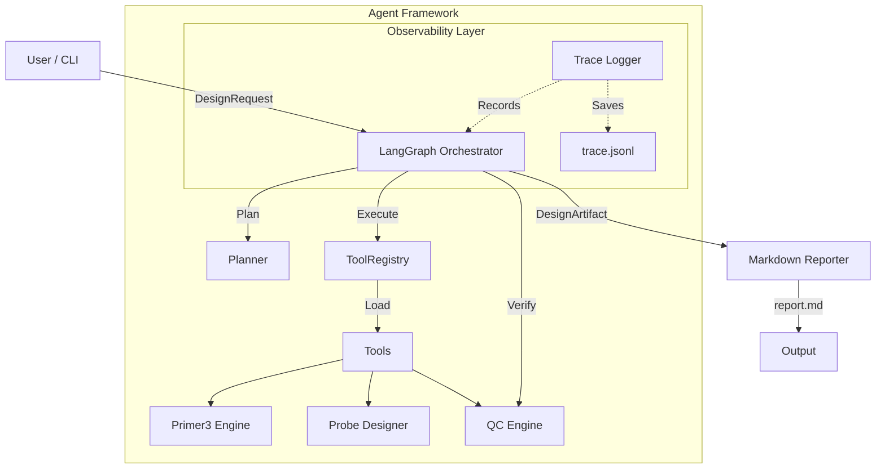

# Assay Design Copilot

**An Agentic Framework for Reproducible Bio-Automation**

> "Building the infrastructure that makes AI reliable for molecular diagnostics."

[](https://www.python.org/downloads/)
[](https://github.com/psf/black)
[](https://github.com/langchain-ai/langgraph)

---

## 🎯 What Does This App Do?

The **Assay Design Copilot** is an AI powered agent that automates the end-to-end design of PCR assays (qPCR/dPCR). It takes a target DNA sequence and autonomously produces ranking-scored primer & probe candidates, validated against quality control rules, and packaged into a reproducible clinical design report.

### The Problem it Solves
Manual assay design is a bottleneck in molecular diagnostics:
- **Time Consuming**: Scientists spend hours manually copying sequences between Primer3, BLAST, and Excel.
- **Error Prone**: Manual data entry leads to transcription errors and failed experiments.
- **Lack of Reproducibility**: "Vibes-based" selection decisions are rarely documented, making it impossible to audit why a specific primer pair was chosen months later.

### The Solution
This Copilot transforms design into a **Software Enigineering Problem**:
1.  **Standardized Inputs**: Strict Pydantic schemas for requests.
2.  **Deterministic Execution**: Every tool call is scored and logged.
3.  **Traceable Decisions**: Full audit trails for every candidate generation and rejection.

---

## 🏗️ System Architecture

This project is not just a collection of scripts; it is a **Compound AI System** designed to orchestrate bioinformatics tools deterministically while allowing for future LLM integration.



## 🚀 Key Architectural Decisions

### 1. The "Framework-First" Approach
Instead of hardcoding logic, we built a reusable **Agent Framework** to manage the lifecycle of bio-design tasks.
- **Why?** Clinical assays require different pipelines (qPCR vs dPCR, SARS-CoV-2 vs Oncology). A framework allows us to swap "tools" and "plans" without rewriting the core engine.
- **Implementation**: See `src/assay_copilot/tools.py` for the `ToolRegistry` and `BaseTool` abstractions.

### 2. Deterministic Core with Type Safety
We use **Pydantic** for all domain models (`DesignRequest`, `DesignCandidate`, `QCResult`).
- **Why?** AI in biology cannot be "vibes-based". Inputs and outputs must strictly adhere to schemas to ensure downstream tools (like synthesis orders) don't fail.
- **Implementation**: See `src/assay_copilot/schema.py`.

### 3. "Unit Tests for Agents" (Evaluation Harness)
We treat the agent's behavior as a regression target.
- **Why?** Upgrading a model or tool library shouldn't silently break assay quality.
- **Implementation**: The `eval.py` harness runs a "Golden Set" of designs and asserts pass rates, enabling confident CI/CD for the agent.

### 4. Full Observability (Tracing & Replay)
Every tool execution is intercepted and logged to a structured trace.
- **Why?** Reproducibility is non-negotiable definition. We need to know *exactly* what parameters were sent to Primer3 six months ago.
- **Implementation**: See `src/assay_copilot/tracing.py`.

---

## 🛠️ Features

- **Automated Design**: Generates primer/probe candidates using `primer3-py`.
- **Stateful Orchestration**: Built on `LangGraph` to manage the "Plan → Execute → Verify" loop.
- **Standardized Reporting**: Produces machine-readable JSON artifacts and human-readable Markdown reports.

---

## 📦 Installation

It is best practice to run this project in a dedicated virtual environment to avoid conflicts with other projects (like `primer-design-automation`).

```bash
# 1. Create a virtual environment
python3 -m venv venv

# 2. Activate the environment
source venv/bin/activate

# 3. Install dependencies
pip install -r requirements.txt
pip install -e .
```

## 💻 Usage

### 1. Design an Assay
Run the copilot to design primers for a target sequence:

```bash
# View all options
python -m assay_copilot.main --help

# Run design
python -m assay_copilot.main design \
  --sequence "TCGATCGTAGCTAGCTAGCATGCTAGCTAGCTAGCTAGCTAGCTAGCTCGATCGTAGCTAGCTAGCATGCTAGCTAGCTAGCTAGCTAGCTAGCTCGATCGTAGCTAGCTAGCATGCTAGCTAGCTAGCTAGCTAGCTAGCTCGATCGTAGC" \
  --name "MyAssay01" \
  --assay-type qPCR \
  --out-dir ./runs
```

**Output:**
- `runs/MyAssay01/artifact.json`: Complete data bundle.
- `runs/MyAssay01/report.md`: Summary report.
- `runs/MyAssay01/trace.jsonl`: Execution log.

### 2. Run Evaluation Suite
Validate the pipeline against the Golden Set:

```bash
python -m assay_copilot.eval
```

---

## 📂 Project Structure

```text
src/assay_copilot/
├── schema.py          # Domain Object Model (Pydantic)
├── tools.py           # Tool Registry & Abstractions
├── tracing.py         # DevOps/Observability (Logging & Replay)
├── workflow.py        # Orchestration Logic (LangGraph)
├── primer3_engine.py  # Tool Implementation: Primer3
├── probe_designer.py  # Tool Implementation: Heuristic Fallback
├── qc.py              # Tool Implementation: Quality Control
└── main.py            # Application Entrypoint
```

---

## 🔮 Future Roadmap

- **LLM Integration**: Replacing the rule-based `RuleBasedProbeDesigner` with an LLM that can read literature for specific probe constraints.
- **Vector Store**: Integrating `LanceDB` to check for specificity against a local genome database.
- **API**: Exposing the `LangGraph` runnable as a FastAPI endpoint.
